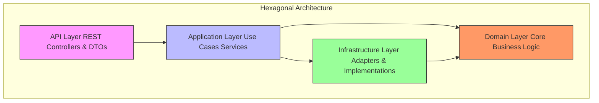

# Kokoro Server

A modular Spring Boot application built with Kotlin, following clean architecture principles to ensure maintainability and separation of concerns.

## Architecture Overview

The project implements a layered hexagonal architecture with a clear separation of concerns:



### Module Responsibilities

```mermaid mindmap
root((Kokoro Server))
API
REST endpoints
Requestgresponse DTOs
Validation
API contracts mapping
Application
Use case implementation
Business orchestration
Transaction management
Workflow coordination
Domain
Business entities
Core domain models
Port interfaces
Framework-agnostic
Infrastructure
Port implementations
JPA entities
Database mappers
External API clients
Technical concerns
```

**Domain** - The heart of the application
- Contains business entities and core domain models
- Defines port interfaces (repository contracts)
- No external dependencies, purely domain logic
- Framework-agnostic and highly testable

**Application** - Business orchestration
- Implements use cases and application services
- Coordinates domain objects to fulfill business requirements
- Acts as the bridge between API and Domain layers
- Handles transaction boundaries and workflow logic

**Infrastructure** - Technical implementation
- Provides concrete implementations of domain ports
- Contains JPA entities, database mappers, and adapters
- Manages persistence, external APIs, and technical concerns
- Implements the dependency inversion principle

**API** - External interface
- Exposes REST endpoints for client communication
- Handles request response DTOs and validation
- Maps between API contracts and application commands
- Entry point for all external interactions

## Technology Stack

| Component        | Technology          | Version |
|------------------|---------------------|---------|
| Language         | Kotlin              | 2.1.0   |
| Framework        | Spring Boot         | 3.4.2   |
| JVM              | Java                | 21      |
| Build Tool       | Gradle (Kotlin DSL) | -       |
| Database         | PostgreSQL          | -       |
| Containerization | Docker Compose      | -       |

## Getting Started

### Prerequisites

- JDK 21
- Docker and Docker Compose

### Setup

1. Copy `example.env` to `local.env` and configure your environment variables
2. Start the database:
   ```bash
   docker-compose --env-file=local.env up -d
   ```
3. Run the application:
   ```bash
   ./gradlew :api:bootRun
   ```

## Project Structure

Each module follows standard MavengGradle conventions with source code located in:
`src/main/kotlin/health/kokoro/<module>/`

The project is organized into these main modules:
- `domain` - Core business logic
- `application` - Use cases and services
- `infrastructure` - Technical implementations
- `api` - REST interface
